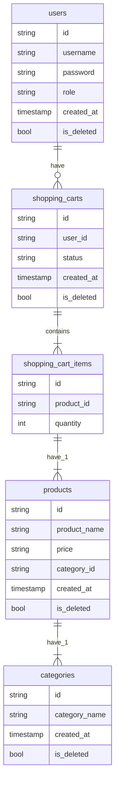

# Store-Api Using Golang
RestfullApi using golang httpRouter and Postgres as Database, This Project Using Layer Architecture:
1. Controller
2. Service
3. Repository

## Entity Relational Diagram

## This Project Has 4 Domain
1. user
2. product
3. shopping cart
4. product category

## How to Run This Project
1. Clone the project using `git clone [URL]` 
2. Create Postgres Database `store-api`
3. Install Dependencies `go mod tidy`
4. Run the Migration using `go run migration/migration.go`
5. Run app using `go run main.go`

# REST API

## Register User
### Request

`POST localhost:3000/api/users`

    curl --location 'localhost:3000/api/users' \
    --header 'x-api-key: RAHASIA' \
    --header 'Content-Type: application/json' \
    --data '{
        "username": "admin",
        "password": "password",
        "role": "ADMIN" 
    }'

## Login
### Request

`POST localhost:3000/api/users/login`
    curl --location 'localhost:3000/api/users/login' \
    --header 'x-api-key: d155d392-ff7f-4569-9465-1387afca7684' \
    --header 'Content-Type: application/json' \
    --data '{
        "username": "admin",
        "password": "password"
    }'

