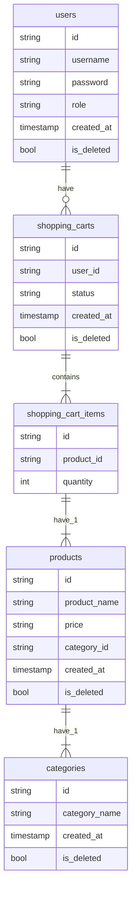

# Store-Api Using Golang
RestfullApi using golang 

## Entity Relational Diagram

```mermaid
erDiagram
    users{
        string id
        string username
        string password
        string role
        timestamp created_at
        bool is_deleted
    }
    products ||--|{ categories: have_1
    products{
        string id
        string product_name
        string price
        string category_id
        timestamp created_at
        bool is_deleted
    }
    shopping_carts ||--|{ shopping_cart_items: contains
    users||--o{ shopping_carts: have
    shopping_carts {
        string id
        string user_id
        string status
        timestamp created_at
        bool is_deleted
    }
    shopping_cart_items ||--|{ products: have_1
    shopping_cart_items{
        string id
        string product_id
        int quantity
    }
    categories{
        string id
        string category_name
        timestamp created_at
        bool is_deleted
    }
```
